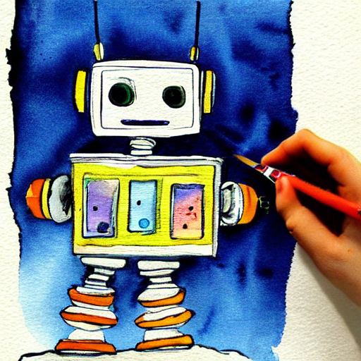

# Stable Diffusion Text-to-Image

🎨 A simple project using the `diffusers` library to generate images from text prompts using Stable Diffusion in Google Colab.

## Demo
📽️ [Watch the demo video](demo_video.mp4)

## Sample Output

## How to Use
1. Open the Colab notebook
2. Run the cells step by step
3. Customize your prompt and generate your own AI images!

## Tools Used
- Python
- Google Colab
- Hugging Face Diffusers
- Stable Diffusion v1.5
